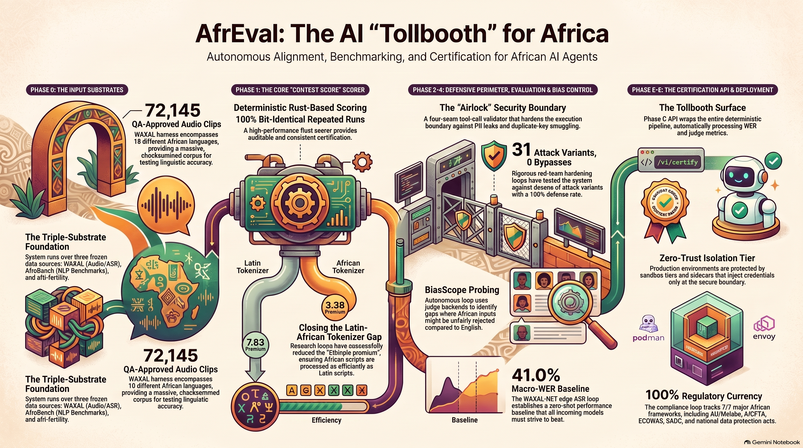

# Milimo AfrEval

**Open-source AI evaluation for Africa — a pre-deployment compliance harness that gates agents with an evidence-linked Context Score and per-language Context Profile, built on WAXAL · AfroBench · afri-fertility.**

**Author:** [Mainza Kangombe](https://www.linkedin.com/in/mainza-kangombe-6214295/)

AfrEval routes every AI agent through a zero-trust sandboxed certification pipeline before it touches a production database, producing an **evidence-linked Context Score** plus a per-language/per-script **Context Profile** that measures how linguistically accurate, culturally safe, economically viable, and functionally secure the model is — inside a zero-trust sandbox.

> **What it is / what it isn't:** AfrEval produces an auditable, evidence-linked evaluation signal — it is a *credible signal and compliance harness*, not a government certificate. Authority comes from ecosystem adoption; the score is the measurement, and the methodology behind it (which probes, which judges, which corpora) is published in every cert.




Built on the generalized **Karpathy Loop** (frozen harness → mutable artifact → instruction file → metric → budget), with every subsystem — tokenizer search, Context Score calibration, BiasScope probing, edge ASR, execution-boundary hardening, compliance — running as an autonomous loop over three frozen data substrates: WAXAL, AfroBench, and afri-fertility.

## Assets & Presentations

Visual assets and presentations detailing the AfrEval architecture and Secure AI Gateway:

- **Video Explainer**: [Building the Milimo AfrEval Tollbooth - A Zero Trust Architecture for Context Aware AI](https://youtu.be/PQfQb-v0Ayg)
- **Benchmarking Infographic**: [AfrEval_African_AI_Benchmarking_Infographic.png](assets/AfrEval_African_AI_Benchmarking_Infographic.png) — High-resolution diagram illustrating African AI benchmarking, zero-trust sandbox execution, and the Context Score pipeline.
- **Secure AI Gateway Slide Deck**:
  - [PDF Deck](assets/slide-deck/AfrEval_Secure_AI_Gateway.pdf) — Complete 15-slide presentation on the AfrEval Secure AI Gateway architecture.
  - [PowerPoint Deck (.pptx)](assets/slide-deck/AfrEval_Secure_AI_Gateway.pptx) — Editable slide deck.
  - [Exported Slide Images](assets/slide-deck/AfrEval_Secure_AI_Gateway/) — Individual slide frame exports (JPEG format, slides 001–015).

## Implementation status

**All 11 target repos have in-tree presence** (all pushed to this repo), with CI + packaging in place. Remaining work is operational, not scaffold: Stage B train pull (currently **blocked on upstream HF Xet 404s**), the Phase C certification API layer, and the server-side isolation tiers (gVisor/Firecracker/Envoy — laptop-unbuildable).

| Area | Repo | Status |
|---|---|---|
| Phase 0 — frozen harnesses | `afreval-harness/` | ✅ **COMPLETE** — all three pins frozen; WAXAL QA pass 2 finished (74,400 clips) with 2,255 drops applied → **QA-approved corpus 72,145 clips / 18 languages** checksummed |
| Phase 1 — Context Score core | `afreval-context-score/` | ✅ Deterministic Rust scorer (bit-identical repeated runs — the acceptance criterion) + deterministic certification pipeline with auditable sha256 certs; **§3.1 SIB-200 win flows through: zero-shot baseline re-certified 53.88→61.55 (structural economics 37.25→62.82)**; **certs carry a Context Profile** (per-language/per-script vector + methodology + rubric manifest) |
| Phase 1 — tokenizer search | `afreval-tokenizer-research/` | ✅ §3.1 search loop with trained BPE candidates; **script-aware candidate PASSES** (Ethiopic premium 7.83→3.38 at zero English-CPT regression); **SIB-200 corpus mix closes the Latin-African gap** (latin 1.55→1.29, ethiopic 3.38→2.83, English CPT unchanged); **N'Ko third number measured** (premium 1.53, was `nan`) |
| Phase 2 — execution boundary | `afreval-airlock/` | ✅ Four defensive seams incl. JWS HS256 clearance; §3.5 red-team hardening loop — **31 attack variants, 0 bypasses, 25 tests** (2026-08-05 rounds fixed 2 real bypasses: unicode-confusable PII + duplicate-key smuggling; added **seam-4 replay protection** — grant `jti` nonce + `ReplayGuard` + optional exact-call binding) |
| Phase 2 — evaluation bias | `afreval-biasscope/` | ✅ §3.3 probe loop (mock/omlx/ollama/api judge backends; acceptance-rate-gap metric) + **live open-source run vs qwen3.6 via Ollama** — genuine gap (delta 1.0, eng rejected/african accepted); **bias-correction wired into certification** |
| Phase 2 — compliance | `afreval-compliance/` | ✅ §3.6 citation-currency loop — **100% current (7/7)**: AU/Malabo/AfCFTA, ECOWAS/SADC, Kenya ODPC, Nigeria NDPC, binding-flagged |
| Phase 4 — edge ASR | `afreval-waxal-net/` | ✅ Loop scaffolding + **zero-shot baseline 41.0% macro-WER** + **OOD protocol** (in-dist 37.56% vs OOD 37.60%); real cert on frozen data scores 53.88 (fail). Fine-tuning gates on Stage B train pull (blocked on upstream HF Xet 404s) |
| Phase 4 — field app | `afreval-field-app/` | ✅ Flutter app **verified in Docker** — `flutter analyze` clean + 5 tests pass (WER/telemetry) via `ghcr.io/cirruslabs/flutter:3.32.5` |
| Phase 5 — on-prem client | `afreval-onprem/` | 🚧 Tauri 2 skeleton embedding scorer + airlock; **trust-root vault fails closed without a configured key** (dev key debug-only); Stronghold, dashboard reuse, local MCP server: post-MVP |
| Phase 5 — dashboard | `afreval-dashboard/` | ✅ Certification + security web surface (build-target-agnostic) |
| Phase 5 — SDK | `afreval-sdk/` | ✅ Python client SDK (local scorer + **API mode**) + TypeScript client (buildable, tested); both packaged (wheel / npm build) — now call the **Phase C certification API** including `diff` / `list_certs` / `stale_certs` |
| Phase C — certification API | `afreval-api/` | ✅ `/v1/certify` (auto-inputs WER/judge + **Context Profile**), `/v1/security`, `/v1/compliance`, `/v1/certs`, `/v1/diff` (per-language/script deltas), `/v1/certs/stale` — the tollbooth surface wrapping the deterministic pipeline |
| Phase E — Envoy sidecar | `afreval-envoy/` | ✅ **Credential-injection sidecar verified in Docker** — injects synthetic cred at the boundary before the upstream tool service |
| Phase E — isolation tier | `afreval-isolation/` | ✅ **Podman/seccomp sandbox tier verified in Docker** — deny-network + KILL syscall classes (gVisor/Firecracker remain server-class, need KVM) |

**Current status:** Phase 0 **closed** (all harnesses frozen, WAXAL QA-approved at 72,145 clips). Phases 1–2 core built + §3.3 live run via **open-source Ollama judge** with bias-correction wired in, compliance **7/7 citation-current** (binding-flagged), §3.1 Latin-African gap closed + N'Ko measured, airlock at 25 tests/0 bypasses with replay protection, **CI + SDK packaging + Phase C certification API live**, code-mixing metrics + OOD protocol in, **certs carry a Context Profile + methodology + diff/staleness endpoints (review remediation R1–R5)**, **field-app verified in Docker, Envoy credential-injection + Podman/seccomp isolation tiers verified in Docker**. Phase 4 WAXAL-NET scaffolding live (baseline 41.0% macro-WER to beat) with Stage B train pull blocked on upstream HF Xet 404s (resumable retry in place).

## Repository structure

```
afreval/
├── assets/                   # Architecture infographics & presentation slide decks
│   ├── AfrEval_African_AI_Benchmarking_Infographic.png
│   └── slide-deck/           # AfrEval Secure AI Gateway presentation (PPTX, PDF, JPEG slides)
├── wiki/                     # LLM-maintained knowledge base — start at wiki/home.md
├── dev-docs/                 # raw source documents (Implementation Bible, Research blueprint)
├── afreval-harness/          # Phase 0 frozen harnesses + WAXAL acquisition/QA tooling
├── afreval-context-score/    # Rust Context Score scorer + weights/{telco,banking}.yaml
├── afreval-tokenizer-research/  # §3.1 tokenizer search loop + BPE candidates
├── afreval-airlock/          # four-seam tool-call validator + hardening loop
├── afreval-biasscope/        # §3.3 judge-bias probe loop
├── afreval-compliance/       # §3.6 citation-currency loop
├── afreval-onprem/           # Tauri 2 air-gapped client (skeleton)
├── afreval-dashboard/        # certification & security dashboard
├── afreval-api/              # Phase C certification HTTP API (the tollbooth surface)
├── afreval-envoy/            # Envoy credential-injection sidecar (docker-compose, Phase E)
├── afreval-isolation/        # Podman/seccomp sandbox tier (Docker-verified, Phase E)
├── autoresearch/             # vendored karpathy/autoresearch — flattened for re-engineering
├── AfroBench/                # vendored McGill-NLP/AfroBench — flattened
│   └── lm-evaluation-harness/  # git submodule (EleutherAI)
└── afri-fertility/           # vendored CipherSenseAI/afri-fertility — flattened
```

## Cloning

The only remaining submodule is `AfroBench/lm-evaluation-harness` (EleutherAI/lm-evaluation-harness, pinned to upstream HEAD `f4d4b3de`):

```bash
git clone --recursive https://github.com/mainza-ai/afreval.git
```

To pull upstream changes into a flattened substrate repo:

```bash
git -C autoresearch remote add upstream https://github.com/karpathy/autoresearch
git -C autoresearch fetch upstream && git -C autoresearch merge upstream/main
```

## The three-layer pattern

| Layer | Where | Owned by |
|---|---|---|
| Raw sources | `dev-docs/` + vendored substrate repos | Human (immutable) |
| The wiki | `wiki/` | LLM agent (maintained via ingest/query/lint per `wiki/AGENTS.md`) |
| The schema | `wiki/AGENTS.md` | Human + LLM (co-evolved) |

## Navigation

- [Wiki home](wiki/home.md) — overview and full index
- [Build plan](wiki/build-plan/phases.md) — Phase 0–5 roadmap with live status
- [Risk register](wiki/build-plan/risk-register.md) — known risks and mitigations
- [Repository layout](wiki/build-plan/repository-layout.md) — the eleven planned repos

## Author & Contact

- **Author**: Mainza Kangombe
- **LinkedIn**: [Mainza Kangombe on LinkedIn](https://www.linkedin.com/in/mainza-kangombe-6214295/)
